# ⚡ Welcome to My Digital Sanctum

  

---

## 🔮 The Alchemist of Code

I am a **Full Stack Developer** specializing in designing and building high-performance, scalable web applications. My work focuses on creating robust digital ecosystems where backend architecture and frontend experience operate seamlessly together. I approach development with both analytical precision and creative thinking, ensuring that every solution is efficient, maintainable, and user-centric.

With hands-on experience in the MERN stack, I develop dynamic, real-time applications and optimize APIs for performance and scalability. I enjoy tackling complex architectural challenges—whether it's structuring efficient data flows, improving system responsiveness, or engineering clean, modular codebases.

I have a strong inclination toward crafting intuitive user interfaces backed by solid engineering principles. From concept to deployment, I aim to deliver solutions that are not only functional but also elegant and future-ready.

Blending a problem-solving mindset with a passion for innovation, I continuously explore new technologies and approaches to push the boundaries of modern web development.

---

## 🛠 Arcane Knowledge (Tech Stack)

### 📜 Programming Languages

  

### 🎨 Frontend Sorcery

  

### ⚙️ Backend Alchemy

  

### 🗄️ Data Vaults

  

### ☁️ Cloud 

  

## 📊 Terminal Analytics

  

  

### 🌌 Contribution Nebula

---

  <i>"Any sufficiently advanced technology is indistinguishable from magic." — Arthur C. Clarke</i>

